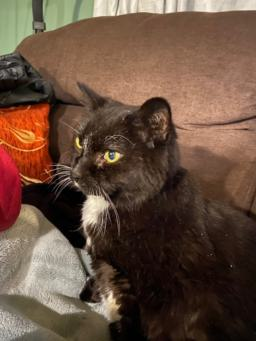
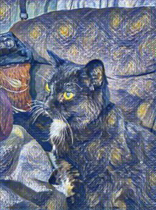
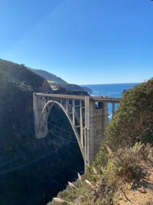
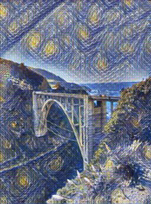
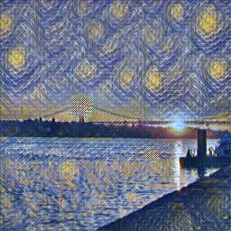

# Johnson et al. 2016 Perceptual Losses for Real-Time Style Transfer
### Overview
This repo contains an unoffical Pytorch implementation of the style transfer model from the paper, [*Perceptual Losses for Real-Time Style Transfer and Super-resolution*](https://arxiv.org/abs/1603.08155) by Justin Johnson, Alexandre Alahi, and Li Fei-Fei. 

### Results
The model was trained to reproduce the style of *Starry Night* by Vincent van Gogh. Here, we include 3 example outputs of the model with input from my camera roll. 





*My cat in the style of Starry Night*






*Bixby bridge in the style of Starry Night*





*Sunset over bridge in Lisbon in the style of Starry Night*


### Training the model 
Training can be run using the following commmand, specifying the path to the dataset, path to the style input image, number of epochs, how often to save the model, and weight for the style loss component of the loss function. 
A complete list of training options can be found in the `TrainOptions` class in train.py, including, e.g., setting batch size.

```
python train.py --data_path "/kaggle/input/cocotest2014/test2014/" --style_image_path "/kaggle/working/starry_night.jpg" --num_epochs 10 --save_epochs 1 --style_weight 30
```

The *Starry Night* model in the repository was trained for ~6 hrs on a  P100 GPU. The COCO2014 test set was used for training. 

### Evaluating the model 
Evaluation can be run using the following commmand, specifying the path to the model checkpoint, path to the input image, and name of the input. 
A complete list of evaluation options can be found in the `EvalOptions` class in eval.py.

```
python eval.py --test_img_path "./results/sunset.jpeg" --checkpoint_net_path "./models/net__9.pt" --test_img_name "sunset"
```

### Implementation details
This implementation closely follows the original paper with the exception of a slight change to the loss function. The mean-squared error loss between the gram matrices was used instead of the Frobenius norm. 

Moreover, the weights for the content, style, and tv regularization may differ from the original paper.

### Acknowledgements
Referenced the loss network implementation in this repository, https://github.com/tyui592/Perceptual_loss_for_real_time_style_transfer, along with the original paper. 

