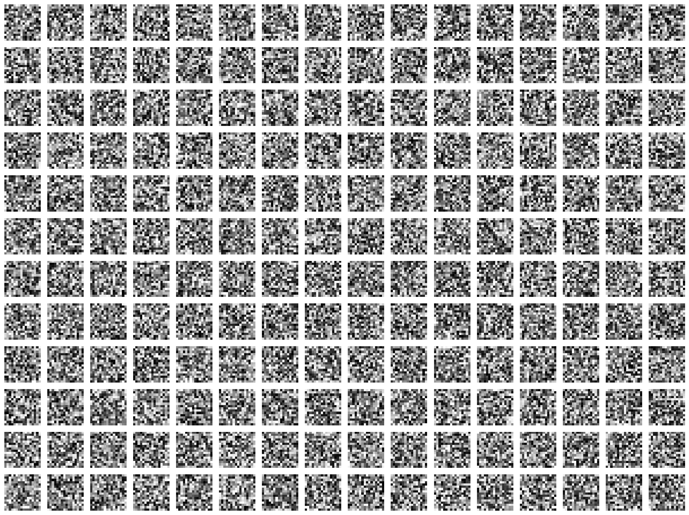
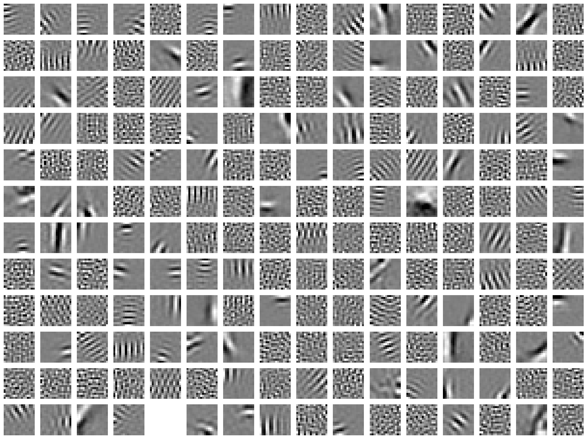

# Olshausen & Field 1996 Emergence of simple-cell receptive field properties by learning a sparse code for natural images

### Overview
This repo contains an unoffical Python implementation of the algorithm for learning a sparse code for natural images from the paper, [*Emergence of simple-cell receptive field properties by learning a sparse code for natural images*](https://www.nature.com/articles/381607a0) by Bruno Olshausen and David Field. 

### Results
The model was trained to reconstruct 16 x 16 patches of 10 whitened natural images using a set of 192 basis functions with a sparseness constraint as in the original paper. Here, we include the 192 basis functions before and after training. After training, most of the receptive fields are oriented and spatially localized akin to simple cell receptive fields. 

*Basis functions prior to training*

*Basis functions after training*

### Training the model 
Training can be run by running the Jupyter notebook `learn_sc_bases.ipynb`. Training parameters are enumerated in the notebook and were selected to match the original paper as closely as possible. 

The model was trained on 1,000,000 16x16 image presentations (~10 hours). This was sufficient to generate spatially localized, oriented basis functions, but a longer training time may be neccesary to completely reach convergence. 

### Acknowledgements
Referenced the C/MATLAB implementation on Bruno Olhausen's website, https://www.rctn.org/bruno/, along with the original paper. 
