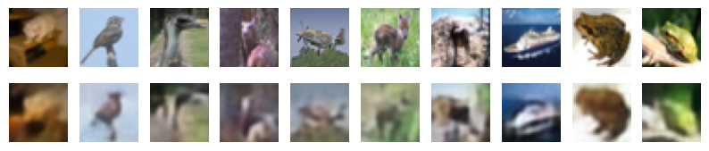
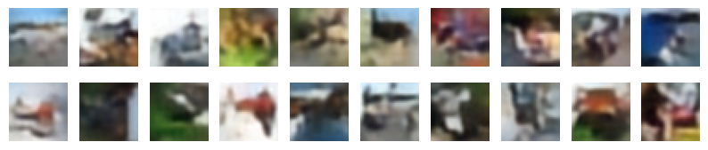

# Oord et al. 2017 Neural Discrete Representation Learning

### Overview
This repository contains an unofficial PyTorch implementation of the VQ-VAE model and PixelCNN prior from the paper, [*Neural Discrete Representation Learning*](https://arxiv.org/pdf/1711.00937v2) by Aaron van den Oord, Oriol Vinyals, and Koray Kavukcuoglu.

### Results
The model was trained on the CIFAR-10 dataset. Below are example outputs showing:
1. Reconstructed images from the VQ-VAE.
2. Images generated using a PixelCNN prior combined with the VQ-VAE.

#### Reconstructed Images

*Reconstructed images from the CIFAR-10 dataset using the VQ-VAE.*

#### Generated Images

*Generated images from the CIFAR-10 dataset using a PixelCNN prior with the VQ-VAE.*

### Running the Code
The implementation is in a single Jupyter Notebook, `vqvae.ipynb`, which can be run to reproduce the results. 

### Acknowledgements
Code generated by ChatGPT was used for the PixelCNN and parts of the vector quanitizer. I also referenced the original paper, *Neural Discrete Representation Learning* by Oord et al. (2017) for implementation details. 
