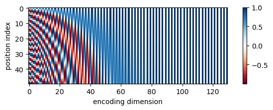
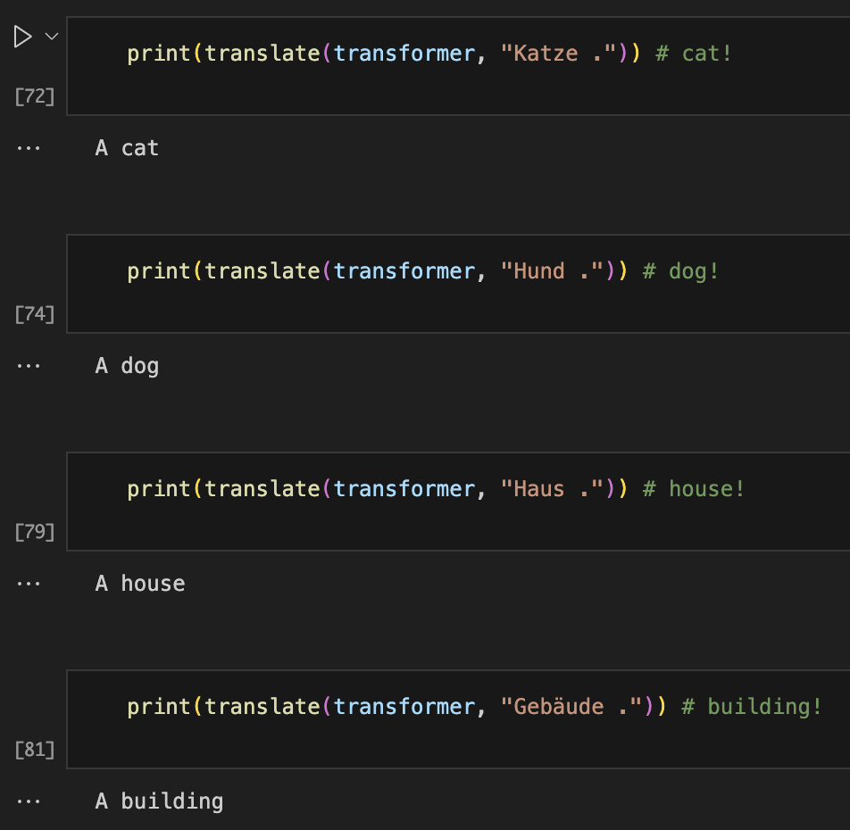

# Vaswani et al 2017 Attention is All You Need

### Overview
This repo contains my PyTorch implementation of the encoder-decoder transformer from the paper, [*Attention is All You Need*](https://www.nature.com/articles/381607a0) by Ashish Vaswani, Noam Shazeer, Niki Parmar, Jakob Uszkoreit, Llion Jones, Aidan N. Gomez, Lukasz Kaiser, and Illia Polosukhin. 

### Results
In `transformer.py`, I implemented each component of the transformer, including the positional encoder, scaled dot product attention, multiheaded attention, encoder layers, and decoder layers. 

In `test_transformer.ipynb`, I test each component of the transformer that I implemented against the corresponding built in PyTorch functions, and plot the positional encoding as a sanity check. The outputs of my implementation and the PyTorch functions match, suggesting the implementation is correct. 

The plot of the positional encoding is shown below: 

*Positional encoding*

In `translation.ipynb`, I substitute my implementation of the transformer architecture for the built in PyTorch function in a PyTorch transformer tutorial, and demonstrate that it can be succesfully used for translating German words to English after training for a few epochs on the Multi30K dataset.

*Examples translations output by trained model.*

### Acknowledgements
Referenced the original paper and [NLP course notes](https://web.stanford.edu/class/cs224n/readings/cs224n-self-attention-transformers-2023_draft.pdf). 
